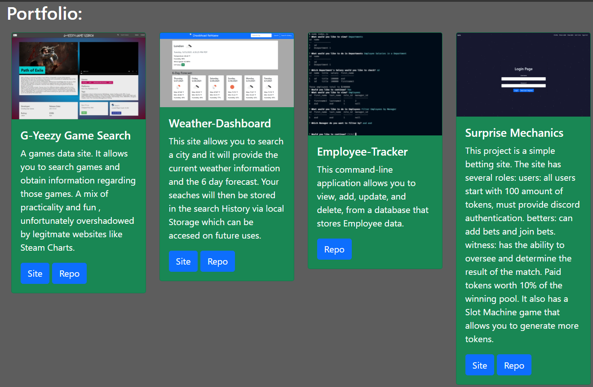

# myWebsite  
  
  
  ## Description:  
  A simple website with 3 main pages: a title, Contact, and Portfolio page. The porfolio consists of some assignments I am proud of. The Contacts and footer page contain links to my accounts or sends a message to me. There is also a button to download my resume.

  ## Table of Contents:  
  - [Description](#-description)
  - [Table of Contents](#-table-of-contents)
  - [Installation](#-installation)
  - [Usage](#-usage)
  - [Contributing](#-contributing)
  - [Tests](#-tests)
  - [Questions](#-questions)

  ## Installation:  
  go to the Github repo. 2. Clone the repo.

  ## Usage:  
  It is a simple personal website
  
  ## Contributing:  
  Me
  
  ## Tests:  
  LOOK AT ME

  
  
  ## Questions:  
  Contact Me: [Github](https://gist.github.com/WellsWu4621), or Email Me @wellsewu.dev@gmail.com  
  Repository Link [myWebsite](https://github.com/WellsWu4621/myWebsite)

